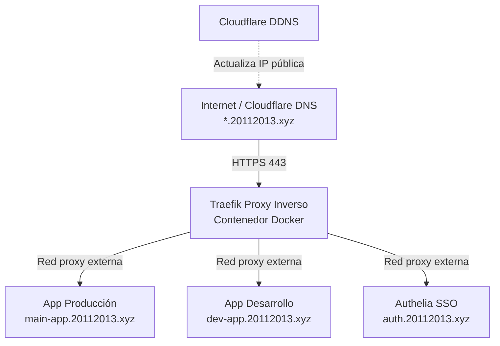

# 🛠️ Sistema de Despliegue en Raspberry Pi (AI-Dev Context)

Este directorio unifica el conocimiento, perfiles de agentes, habilidades (skills) y plantillas necesarias para desarrollar, empaquetar y desplegar de forma autónoma cualquier nueva aplicación o servicio en la infraestructura de la Raspberry Pi de **jmateosj**.

---

## 📐 1. Arquitectura de Infraestructura

La Raspberry Pi actúa como servidor local/taller doméstico configurado con el siguiente stack de base (definido en el repositorio `auto-deploy`):

1. **Proxy Inverso (Traefik v2.11)**:
   - Recibe todo el tráfico HTTPS en el puerto `443`.
   - Utiliza certificados comodín (Wildcard) de Let's Encrypt para `*.20112013.xyz` mediante el DNS-Challenge de Cloudflare.
   - Forzado de redirección HTTP -> HTTPS a nivel global de entrypoint.
2. **DNS & Cloudflare**:
   - Dominio base: `20112013.xyz`.
   - Wildcard CNAME/A record apuntando a la IP de casa.
   - El servicio `cloudflare-ddns` corre de forma permanente para actualizar la IP dinámica pública de la red.
3. **Autenticación (Authelia)**:
   - Proveedor de SSO (Single Sign-On) expuesto en `auth.20112013.xyz`.
   - Protege los servicios internos o dashboards mediante el middleware `authelia@docker` configurado en las etiquetas de Traefik.
4. **Red de Contenedores**:
   - Red Docker externa llamada `proxy`. Todos los proyectos deben conectarse a esta red externa en su `docker-compose.prod.yml` para poder ser enrutados por Traefik.

---

## 🔒 2. Seguridad & Secretos

- **Cierre de puertos**: La Raspberry Pi no expone ningún puerto al exterior salvo los puertos estándar de Traefik (`80` y `443`). Bases de datos, cachés y otros servicios auxiliares no exponen puertos fuera de la red interna de Docker del proyecto, o bien se limitan a `127.0.0.1` (localhost) para desarrollo/trazabilidad local.
- **Git sin Secretos**: Bajo ningún concepto se deben commitear credenciales, claves API o contraseñas reales.
- **Generación dinámica de `.env`**: La compilación del archivo `.env` en producción se gestiona dinámicamente en tiempo de despliegue mediante las variables cargadas desde **GitHub Secrets**.
- **Password URL Encoding**: Las URI de conexión (como `DATABASE_URL`) con caracteres especiales en la contraseña deben codificarse en el workflow de GitHub Actions usando un script en línea de Python.

---

## 📂 3. Almacenamiento & Aislamiento

Para garantizar que los despliegues de desarrollo (`dev`) y producción (`main`) de una misma aplicación no colisionen ni compartan datos accidentalmente, se aplican dos reglas de aislamiento:

1. **Aislamiento de Proyecto Docker (`-p`)**:
   - Cada despliegue se levanta usando un nombre de proyecto explícito en Compose: `docker compose -p [proyecto]-[rama] ...` (por ejemplo, `electro-dev` y `electro-main`).
2. **Volúmenes en SSD externo**:
   - La Raspberry Pi cuenta con un SSD de alto rendimiento montado en `/mnt/ssd/`.
   - La persistencia de datos (PostgreSQL, MinIO, archivos de subida, etc.) debe apuntar a directorios aislados por rama y proyecto bajo:
     `/mnt/ssd/[nombre-proyecto]/${BRANCH}/` (ej. `/mnt/ssd/sat-manager/dev/postgres`).

---

## 🌿 4. Estrategia de Ramas (GitFlow) & DNS

Para desplegar y enrutar correctamente las ramas, se sigue esta convención de nombres y subdominios:

| Rama Git | Entorno | Nombre Proyecto Docker | Subdominio Resultante |
| :--- | :--- | :--- | :--- |
| `main` | Producción (`prod`) | `[proyecto]-main` | `[proyecto].20112013.xyz` |
| `dev` | Desarrollo (`dev`) | `[proyecto]-dev` | `dev-[proyecto].20112013.xyz` |
| `v*.*.*` (tag) | Release / QA | `[proyecto]-[tag-sanitizado]` | `[proyecto]-[tag-sanitizado].20112013.xyz` |

> [!WARNING]
> **Subdominios de un solo nivel**: Debido a que Let's Encrypt y Cloudflare resuelven un wildcard de un solo nivel (`*.20112013.xyz`), los entornos de desarrollo no pueden usar subdominios de segundo nivel como `dev.app.20112013.xyz` (ya que requeriría `*.*.20112013.xyz`). Se debe usar obligatoriamente el formato de guion: `dev-app.20112013.xyz`.

---

## 🛠️ 5. Uso de las Plantillas y Contextos

En las subcarpetas adyacentes encontrarás todo lo necesario para iniciar un nuevo proyecto:
- **`skills/`**: Definición de la Skill de despliegue para instruir a cualquier agente de inteligencia artificial que colabore en el código.
- **`agents/`**: Instrucciones específicas de sistema (System Prompts) para los agentes `@architect` y `@deploy`.
- **`templates/`**: Plantillas estructuradas de Docker Compose y workflows de GitHub Actions para elegir según la naturaleza del proyecto.
